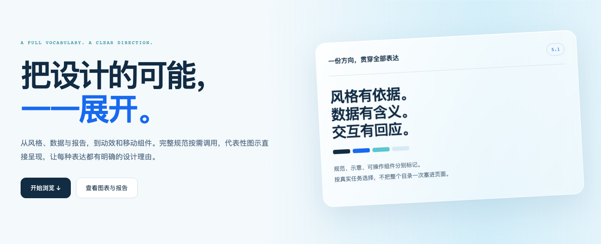
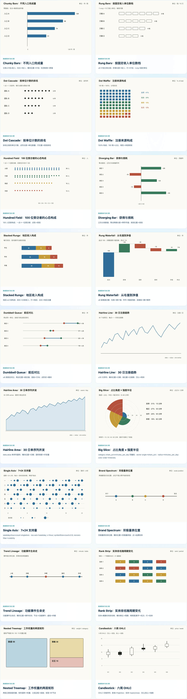
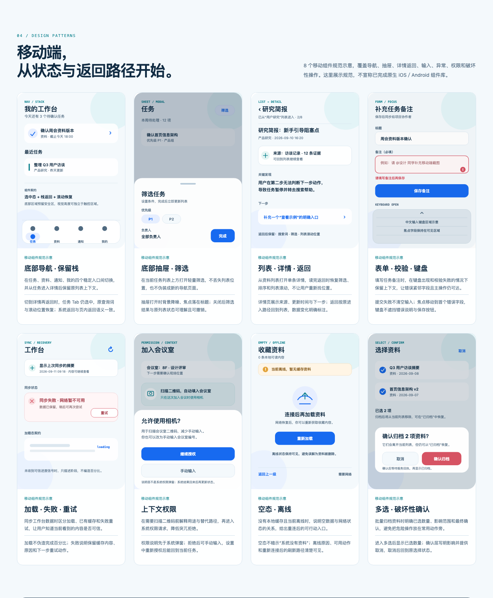

# 虾不滑设计栈

**让 Agent 从“生成一个页面”，走到“有明确风格、信息准确、交互可用的设计”。**

一套可安装的设计 Skill：主控负责需求、风格确认和验收，五个专项 Skill 按需补齐视觉参考、图表报告、交互动效、演示稿和技术图。适用于产品界面、网站、移动原型、数据报告、HTML 演示与交互说明页。



[查看完整长海报](docs/full-poster.png) · [安装与升级](INSTALL.md) · [能力和依赖边界](COMPATIBILITY.md)

## 一句话安装

把本仓库链接或下载的完整目录交给有本地文件与终端能力的 Agent，说：

> 安装这个虾不滑设计栈。先读 INSTALL.md，识别当前 Agent 的技能目录；有旧版就完整清理替换，包括旧 frontend-slides、重复副本和已确认的旧路由引用。安装全部六个 Skill 与资产，最后运行完整性检查并打开本地演示验证。不要删除其他 Skill 或共用依赖。

Agent 会使用根目录 `install.py`。它不依赖 Codex、不联网、不自动购买服务或安装系统依赖。旧版退出生效目录，新版整目录替换，避免旧文件混入；外部备份只用于失败恢复和回滚，不会被加载。

手动安装示例：

```sh
python3 install.py install --host codex
python3 install.py verify --host codex
```

Claude Code 使用 `--host claude`，Cursor 使用 `--host cursor`；其他宿主使用 `--host generic --target "实际技能目录"`。Windows 可使用 `py -3`。不确定当前宿主时安装器会停止，不猜测并修改所有 Agent。

## 能做什么

| 能力 | 包含内容 |
|---|---|
| 风格与视觉 | 24 个方向、对应元素/配色/排版规范与原图，74 份品牌参考、34 套演示构图参考 |
| 数据与报告 | 61 个图表范式、12 套报告版式规范；数据粒度、分母、尺度、缺失值、布局与导出要求 |
| 动效与触感 | 29 个经典交互机制、8 个触感专项、20 类动效配方及页面编排、素材、测量等工作流 |
| 图形运行时 | 本地 D3、Three.js、p5.js 与适配器；数据更新、空间场景、生成过程、暂停和资源清理 |
| 移动体验 | 导航、抽屉、返回上下文、表单、加载/失败、权限、离线和确认的规范与8个示意 |
| 演示与技术图 | 固定舞台 HTML、分页打印/PDF 辅助、PPTX 内容清点，以及流程/架构/状态/时序图 |

**规范数量不等于预制组件数量。** 海报展示 18 个图表、4 套报告代表编排，并列出完整规范目录；静态示意、纯状态模型、可操作组件和需要依赖的工作流分别标明。没有把每种规范都宣传成已经验证的生产组件。

<details>
<summary>展开查看数据图和移动规范</summary>





</details>

## 六个 Skill 怎样协作

| Skill | 职责 |
|---|---|
| `xiabuhua-product-design` | 需求、风格确认、设计合同、路由与最终验收 |
| `brand-style-reference` | 风格、元素、色彩、字体角色和构图参考 |
| `ui-interaction-reference` | 具体交互选择、手感诊断与能力缺口探索 |
| `html-ppt-component-museum` | 本地机制、数据图、触感与图形运行时 |
| `html-deck-runtime` | 固定舞台、导航、适配和打印，不决定风格 |
| `fireworks-tech-graph` | 技术图语义、拓扑、布局与导出 |

主控先确认方向，再按任务调用必要的分支。静态页面不必加载动效库，已有风格的小改动不重新投票，单一组件不读取整套参考。数据含义与拓扑不能被视觉样式覆盖。

## 直接体验

在仓库根目录运行：

```sh
python3 -m http.server 8000 --bind 127.0.0.1
```

打开 `http://127.0.0.1:8000/skills/xiabuhua-product-design/assets/demo/index.html`。图形模块使用本地 HTTP，所有必要图片、组件脚本和图形库均在仓库内；不要只下载单个 HTML 文件。

## 升级与验证

- 六个最新成员及资产以 `manifest.json` 为发布清单；安装后逐文件校验。
- 旧版同名目录完整替换；已确认的 `frontend-slides` 迁出生效目录。无关技能和共用 `node_modules` 不删除。
- 旧规则引用通过 `--rules` 检查；明确属于旧设计栈的规则才使用 `--rewrite-rules` 自动迁移。插件来源需通过宿主管理，不擅自删除整个插件缓存。
- 安装器提供并发锁、失败恢复和有修改保护的回滚。详细命令与异常处理见 [INSTALL.md](INSTALL.md)。

设计流程与浏览器演示可在非 Codex 环境使用；宿主的自动发现、模型能力、原生画布和导出工具仍有各自边界。依赖、实际验证范围和不能承诺的能力见 [COMPATIBILITY.md](COMPATIBILITY.md)。

自有 Skill、脚本与示意资产采用 [MIT 许可证](LICENSE)，允许使用、修改和商业使用，并保留版权与许可声明。第三方库、字体和参考资产保留各自许可，根目录 MIT 不替代它们的许可；见 [THIRD_PARTY_NOTICES.md](THIRD_PARTY_NOTICES.md)。
